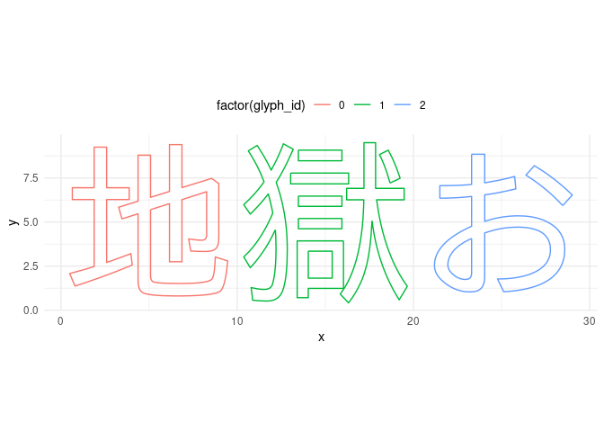
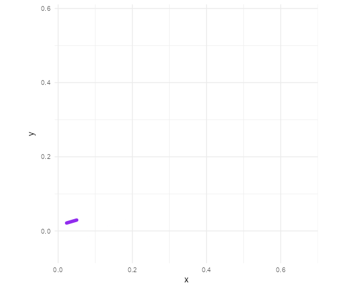

<!-- README.md is generated from README.Rmd. Please edit that file -->

string2path
===========

<!-- badges: start -->

<!-- badges: end -->

This is an experimental R package using some Rust code to extract path
information from TTF font file.

Installation
------------

If you are using Windows, you are lucky. Because this repository
provides pre-compiled binary for you, you don’t need to install Rust
toolchain.

Otherwise, you need to have Rust toolchain installed before trying to
install this package. See
<a href="https://www.rust-lang.org/tools/install" class="uri">https://www.rust-lang.org/tools/install</a>
for the installation instructions.

    # install.packages("devtools")
    devtools::install_github("yutannihilation/string2path")

Example
-------

    library(string2path)
    library(ggplot2)

    # This TTF file is downloaded from https://ipafont.ipa.go.jp/.
    # For installed fonts, you can use systemfonts::system_fonts()
    # to lookup the path.
    d <- string2path("地獄お", "./fonts/ipam.ttf")

    d <- tibble::rowid_to_column(d)

    ggplot(d) +
      geom_path(aes(x, y, group = id, colour = factor(glyph_id))) +
      theme_minimal() +
      coord_equal() +
      theme(legend.position = "top")

    library(gganimate)
    d <- string2path("蹴", "./fonts/ipam.ttf")
    d <- tibble::rowid_to_column(d)

    ggplot(d) +
      geom_path(aes(x, y, group = id), size = 2, colour = "purple2", lineend = "round") +
      theme_minimal() +
      coord_equal() +
      transition_reveal(rowid)

Resources
---------

If you are curious about how you can use R and Rust, the following
resources might help:

-   [Using Rust code in R packages](https://jeroen.github.io/erum2018)
    by Jeroen Ooms
-   <a href="https://github.com/r-rust/hellorust/" class="uri">https://github.com/r-rust/hellorust/</a>
    is useful to see the basic structure
-   <a href="https://github.com/clauswilke/sinab" class="uri">https://github.com/clauswilke/sinab</a>
    is also a cool R package with the power of Rust.
-   [“Calling Rust code from C” section of
    Rustonomicon](https://doc.rust-lang.org/nomicon/ffi.html?highlight=extern#calling-rust-code-from-c).
    This page describes mostly about how to call C code from Rust, but
    it’s useful to know how it works as the vice versa is very similar.
-   [An answer to the question “How to return byte array from Rust
    function to FFI
    C?”](https://users.rust-lang.org/t/how-to-return-byte-array-from-rust-function-to-ffi-c/18136/4).
    This might be very obvious to those who are familiar with C, but it
    takes some time for me to figure out that I need to pass the data
    and the length at the same time, otherwise C side cannot know the
    size of the data.
