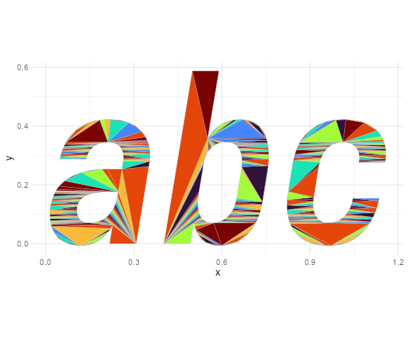

# string2path


<!-- badges: start -->

[](https://github.com/yutannihilation/string2path/actions)
[](https://lifecycle.r-lib.org/articles/stages.html#experimental)
[](https://CRAN.R-project.org/package=string2path)
[](https://yutannihilation.r-universe.dev)

<!-- badges: end -->

The string2path R package converts a text to paths of the outlines of
each glyph, based on a font data. Under the hood, this package is
powered by [the savvy
framework](https://yutannihilation.github.io/savvy/guide/) to use these
two Rust crates:

- [ttf-parser](https://github.com/harfbuzz/ttf-parser) for parsing
  font data. TrueType font (`.ttf`) and OpenType font (`.otf`) are
  supported.
- [lyon](https://github.com/nical/lyon/) for tessellation of polygons
  and flattening the curves.

## Installation

``` r
install.packages("string2path")
```

### Development version

The development version is available on
[R-universe](https://r-universe.dev/):

``` r
install.packages("string2path",
  repos = c(
    yutannihilation = "https://yutannihilation.r-universe.dev",
    CRAN = "https://cloud.r-project.org"
  )
)
```

If you want to install from source, you need to have Rust toolchain
installed before trying to install this package. See
<https://www.rust-lang.org/tools/install> for the installation
instructions.

## Example

### `string2path()`

``` r
library(string2path)
library(ggplot2)

d <- string2path("カラテが\n高まる。", "Noto Sans JP", font_weight = "bold")

d <- tibble::rowid_to_column(d)

ggplot(d) +
  geom_path(aes(x, y, group = path_id, colour = factor(glyph_id)),
            linewidth = 1.5) +
  theme_minimal() +
  coord_equal() +
  theme(legend.position = "top") +
  scale_colour_viridis_d(option = "H")
```


``` r

library(gganimate)
d <- string2path("蹴", "Noto Sans JP")
d <- tibble::rowid_to_column(d)

ggplot(d) +
  geom_path(aes(x, y, group = path_id),
            linewidth = 2, colour = "purple2", lineend = "round") +
  theme_minimal() +
  coord_equal() +
  transition_reveal(rowid)
```


#### `dump_fontdb()`

Note that `"Noto Sans JP"` above (and `"Iosevka SS08"` below) is the
font installed on my local machine, so the same code might not run on
your environment. You can use `dump_fontdb()` to see the available
combination of font family (e.g. `"Arial"`), weight (e.g. `"bold"`), and
style (e.g. `"italic"`).

``` r
dump_fontdb()
#> # A tibble: 449 × 5
#>    source                                  index family        weight style 
#>    <chr>                                   <int> <chr>         <chr>  <chr> 
#>  1 "C:\\WINDOWS\\Fonts\\arial.ttf"             0 Arial         normal normal
#>  2 "C:\\WINDOWS\\Fonts\\arialbd.ttf"           0 Arial         bold   normal
#>  3 "C:\\WINDOWS\\Fonts\\arialbi.ttf"           0 Arial         bold   italic
#>  4 "C:\\WINDOWS\\Fonts\\ariali.ttf"            0 Arial         normal italic
#>  5 "C:\\WINDOWS\\Fonts\\ariblk.ttf"            0 Arial         black  normal
#>  6 "C:\\WINDOWS\\Fonts\\bahnschrift.ttf"       0 Bahnschrift   normal normal
#>  7 "C:\\WINDOWS\\Fonts\\BIZ-UDGothicB.ttc"     0 BIZ UDGothic  bold   normal
#>  8 "C:\\WINDOWS\\Fonts\\BIZ-UDGothicB.ttc"     1 BIZ UDPGothic bold   normal
#>  9 "C:\\WINDOWS\\Fonts\\BIZ-UDGothicR.ttc"     0 BIZ UDGothic  normal normal
#> 10 "C:\\WINDOWS\\Fonts\\BIZ-UDGothicR.ttc"     1 BIZ UDPGothic normal normal
#> # ℹ 439 more rows
```

You can also specify the font file directly. Pomicons is a font
available on
[gabrielelana/pomicons](https://github.com/gabrielelana/pomicons),
licensed under SIL OFL 1.1.

``` r
pomicons_file <- here::here("fonts", "Pomicons.ttf")
if (!file.exists(pomicons_file)) {
  dir.create(dirname(pomicons_file))
  curl::curl_download(
    "https://github.com/gabrielelana/pomicons/blob/master/fonts/Pomicons.ttf?raw=true",
    destfile = pomicons_file
  )
}

d_tmp <- string2path("\uE007", pomicons_file)

ggplot(d_tmp) +
  geom_path(aes(x, y, group = path_id), linewidth = 5, colour = "#26d1a9") +
  theme_minimal() +
  coord_equal()
```


### `string2fill()`

``` r
d <- string2fill("abc", "Iosevka SS08", font_weight = "bold", font_style = "italic")

ggplot(d) +
  geom_polygon(aes(x, y, group = triangle_id, fill = factor(triangle_id %% 7)),
               colour = "grey", linewidth = 0.1) +
  theme_minimal() +
  coord_equal() +
  theme(legend.position = "none") +
  scale_fill_viridis_d(option = "H")
```



### `string2stroke()`

``` r
for (w in 1:9 * 0.01) {
  d <- string2stroke("abc","Iosevka SS08", font_weight = "bold", font_style = "italic", line_width = w)
  
  p <- ggplot(d) +
    geom_polygon(aes(x, y, group = triangle_id, fill = factor(triangle_id %% 2)),
                 colour = "grey", linewidth = 0.1) +
    theme_minimal() +
    coord_equal() +
    theme(legend.position = "none") +
    scale_fill_manual(values = c("purple", "pink"))
  plot(p)
}
```


## `tolerance`

`tolerance` controls resolution of the tessellation. You can reduce
tolerance to get higher resolutions. In most of the cases, `1e-5` ~
`1e-6` should be enough. For more details, please refer to [lyon’s
official
document](https://docs.rs/lyon_geom/latest/lyon_geom/#flattening).

``` r
for (tolerance in c(1e-1, 1e-2, 1e-3, 1e-4, 1e-5, 1e-6, 1e-7)) {
  d <- string2fill("abc", "Iosevka SS08", font_weight = "bold", font_style = "italic", tolerance = tolerance)
  
  p <- ggplot(d) +
    geom_polygon(aes(x, y, group = triangle_id),
                 fill = "transparent", colour = "black", linewidth = 0.5) +
    theme_minimal() +
    coord_equal() +
    ggtitle(paste0("tolerance: ", tolerance))
  plot(p)
}
```


